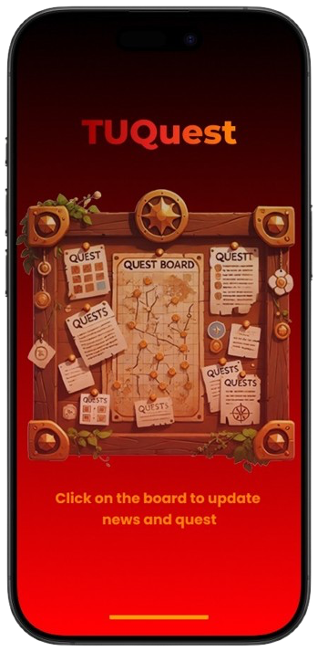

# __Portfolio__

### __Summary__
Computer Engineering student with a strong interest in Data Analyst, Data Engineer, and Data Scientist roles. Experienced in Data Science through a Credit Risk Model competition project, focusing on Big Data analysis to build a model for predicting default risk according to the competition objectives. Also experienced in Data and Image Preprocessing for OCR, including image preparation, data cleaning, and data normalization of OCR outputs.

### __Skill__
- Programming Languages: Python, Java, JavaScript, C, Assembly
- Data Analysis & Visualization: SQL, Power BI, Microsoft Excel
- Development Tools & Frameworks: Django, Git, HTML, CSS, Bootstrap
- Multimedia: Figma

### Projects Experience
#### *Credit Risk Model | Data Science*

- Managed and processed big data.
- Developed a Machine Learning model to predict the risk of customers defaulting on loans.

Tools and Techniques: Python, Pandas, Data Preprocessing, Feature Engineering 
Visit: https://www.kaggle.com/competitions/home-credit-credit-risk-model-stability/overview

#### *FlashBook | Web Applications*

  
  
  

- Built a web application for vocabulary practice featuring Flashcard and WordGuess games.
- Designed and structured the database to ensure scalability and efficient performance.
- Created user-friendly UI/UX and developed a secure, stable backend system.

Tools and Techniques: Python, JavaScript, Django, HTML, CSS, Bootstrap 

*TUQuest | Mobile Applications*

  
  
  

- Responsible for the frontend development of the project.
- Developed a mobile application for university news and event notifications.
- Implemented key features such as emergency alerts, important announcements, and university event reminders.

Tools and Techniques: Flutter, Dart, Figma, Firebase, Android Studio 
