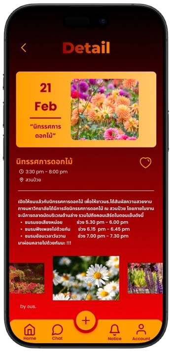

# __Portfolio__

### __Summary__
Third-year Computer Engineering student at Thammasat University with experience in web development using Django. Designed intuitive UI/UX for usability and built a stable, secure backend with efficient data handling. Also skilled in data science, developing a credit risk prediction model for a competition using big data.

### __Skill__
- Frameworks: Django, Bootstrap, Flutter
- Programming: Python, Java, JavaScript, Assembly, Dart
- Development Tools: Git, SQL, HTML, CSS
- Multimedia: Adobe Illustrator, Figma

### Projects Experience
#### *Credit Risk Model | Data Science*

- Managed and processed big data.
- Developed a Machine Learning model to predict the risk of customers defaulting on loans.

Tools and Techniques: Python, Pandas, Data Preprocessing, Feature Engineering 
Visit: https://www.kaggle.com/competitions/home-credit-credit-risk-model-stability/overview

#### *FlashBook | Web Applications*

  
  
  

- Built a web application for vocabulary practice featuring Flashcard and WordGuess games.
- Designed and structured the database to ensure scalability and efficient performance.
- Created user-friendly UI/UX and developed a secure, stable backend system.

Tools and Techniques: Python, JavaScript, Django, HTML, CSS, Bootstrap 
Visit: https://flashbook.pythonanywhere.com

*TUQuest | Mobile Applications*

  
  
  

- Responsible for the frontend development of the project.
- Developed a mobile application for university news and event notifications.
- Implemented key features such as emergency alerts, important announcements, and university event reminders.

Tools and Techniques: Flutter, Dart, Figma, Firebase, Android Studio 
Visit: __*IN PROCESS*__